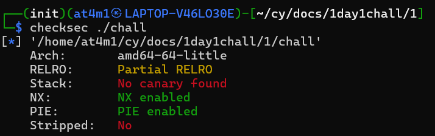
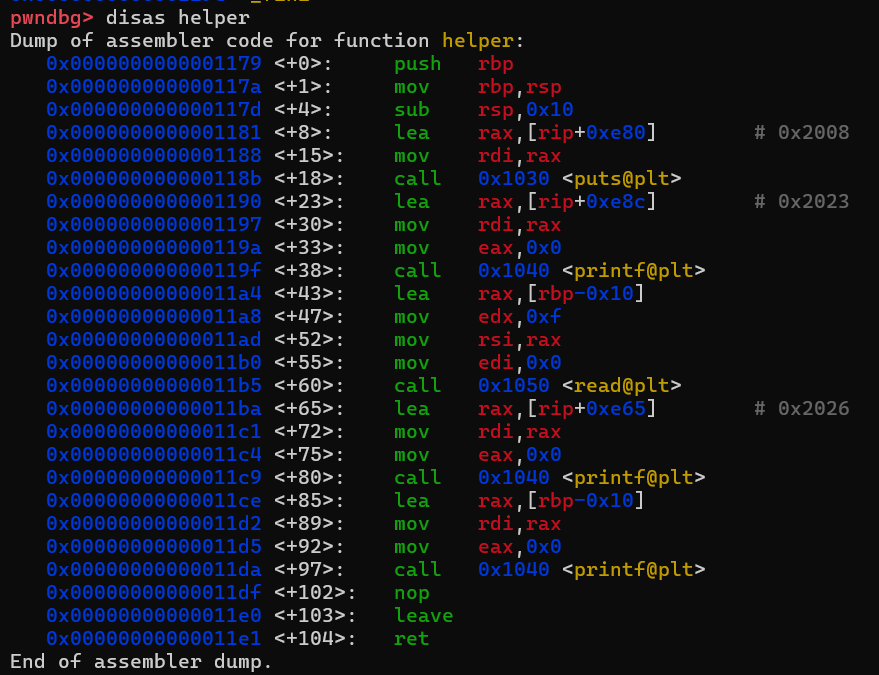
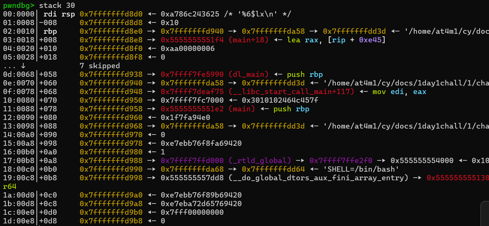
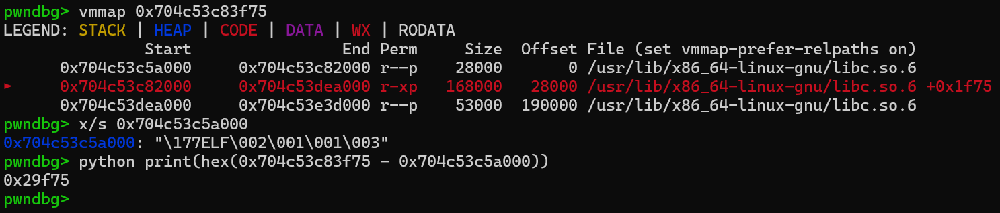
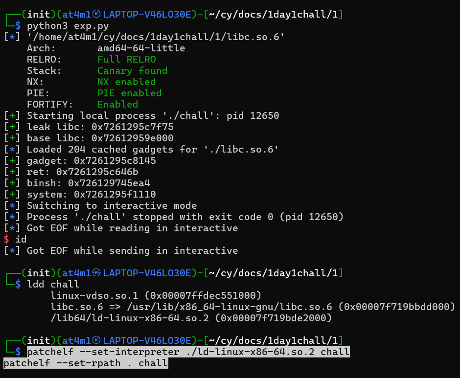
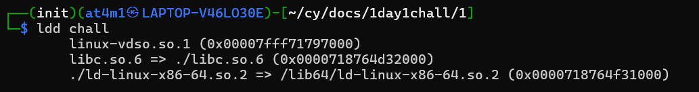
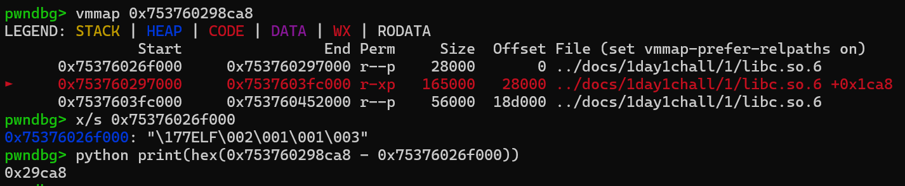
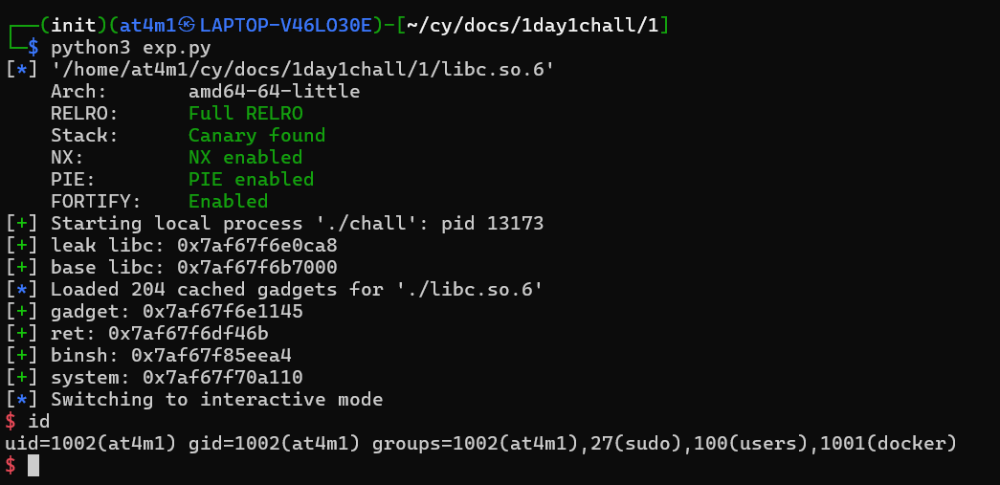

# Writeup

jadi disini gw bakal ngerjain ulang soal ret2libc via format strings tanpa adanya ai

kalo dilihat pake checsec kelihatan kalo gak ada canary tapi PIE nya enabled dan kalo PIE nya enabled biasanya ASLR juga ada

Dari source code nya kelihatan kalo printf di function helper rentan sama format strings tepatnya di line ke 13, dan scanf di function main rentan sama buffer overflow, kelihatan kalo disitu gak dikasih batesan size nya

jadi disini karena printf nya rentan karena gak dikasih formatnya, kalo dicoba dengan %p ini bakal leak RDI nya dan karena ini leak RDI berarti yang keleak itu Calling Convention kayak RDI RSI RDX R8 R9 dan kalo udah lebih dari itu? 

kalo lebih dari itu bakal masuk ke stack yang berarti bisa leak segala macam hal bahkan libc target utama gw

pertama gw coba break di helper+97 tempat dimana rentan format strings lalu gw run

setelahnya gw coba cek di stack dan benar aja ada libc nya tepatnya di urutan ke 21, darimana 21? stack mulai jika sudah lebih dari Calling Convention yang berarti mulai dari ke 6

selanjutnya gw coba leak dan berhasil bahkan sudah dapat offsetnya juga, sisanya gw tinggal mencari gadget, ret, binsh dan system juga offset buffer nya

sekarang gw coba jalanin dan harusnya berhasil tapi ternyata gw gagal, pas gw cek pake ldd ternyata libc.so.6 yang dipake salah, habis itu cuma gw benerin dengan patch

dan sudah benar sekarang, tapi masalahnya satu offsetnya pasti berbeda jadi gw coba ulang buat dapetin offset dari leaknya ke base

offset dari leak ke base udah dapet sisanya ya ubah pake offset yang baru dan jalanin pake script yang sama 

dan ya gw berhasil dapetin shell nya

---

## Lesson Learned
- jangan lupa cek file nya pake ldd dan sesuainkan dengan yang benar
