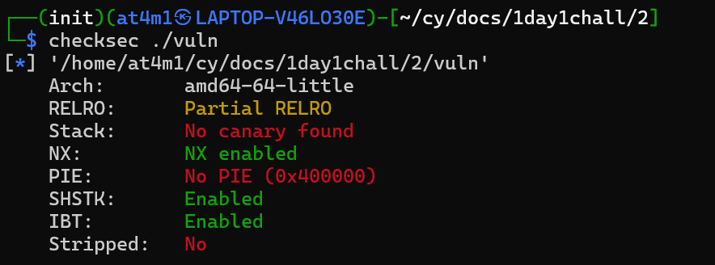
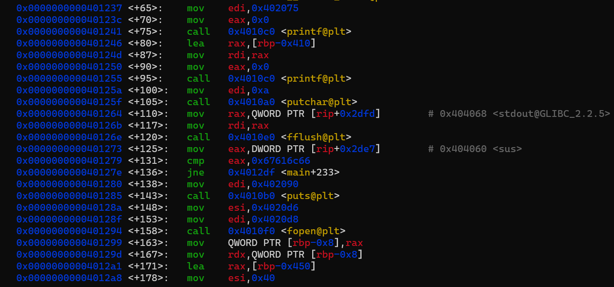
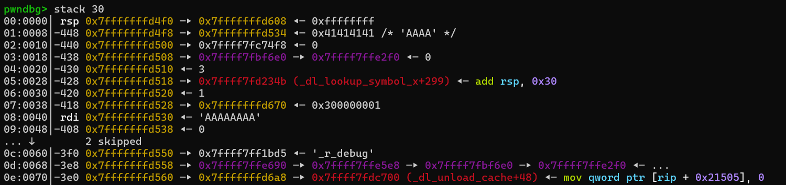
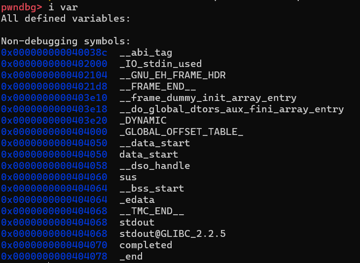
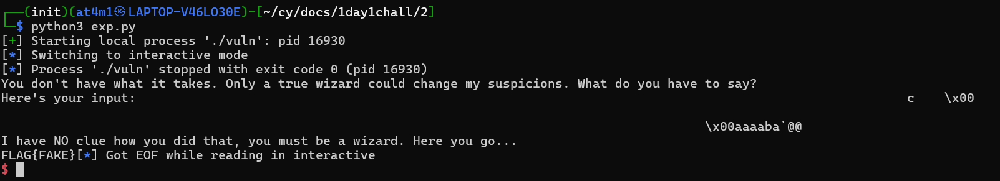
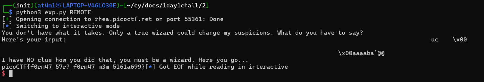

# Writeup

Hari ini gw mau coba belajar Format String pake fmtstr_payload punya nya si pwntools yang bisa automate

Gw bakal pake file chall nya picoCTF yang judul Challenges nya *format string 2*

Langsung aja gw coba buat ngelihat ada protection apa aja pake checksec

Kelihatan disitu kalo pie nya gak ada dan canary nya juga gak ada yang berarti address binary nya bakal sama gak berubah dan gak ada perlindungan buffer overflow

Nah kalo dilihat source code nya kelihatan kalo kerentanan Format String ada di line ke 14 karena printf nya gak dikasih format

Disini gw coba baca source code nya sama baca dikit dikit assembly nya buat melatih tanpa source code 

printf yang rentan ada di main+95 kalo gw coba break disitu lalu di run dan gw coba masukin di inputnya `AAAAAAAA` lalu cek di stack kelihatan kalo input gw masuk ke baris ke 14

Dari assembly dan source code nya juga gw lihat ada pengecekan untuk get flag nya yaitu variabel global yang namanya sus, valuenya wajib compare atau cmp sama dengan 0x67616c66

Jadi selanjutnya gw bakal overwrite si variabel global ini buat ganti valuenya dengan value win pake fmtstr_payload

Sisanya tinggal diterapin ke script dan jalanin juga disini gw bikin fake flag untuk uji coba

Dan ya gw berhasil buat dapetin flagnya alias bypass logicnya

Selanjutnya gw coba terapin pake REMOTE nya

Gw udah kelar buat dapetin flag sebenarnya dari Challenges picoCTF ini

---

## Lesson Learned
- pake fmtstr_payload kalo hasil dari printf yang Format String gak dikasih outputnya