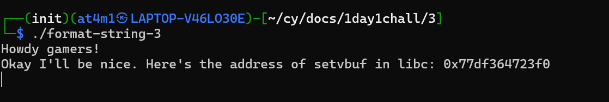
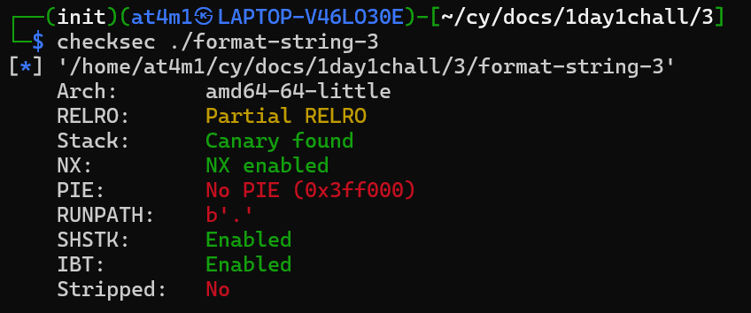
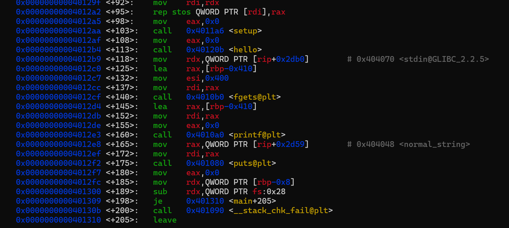
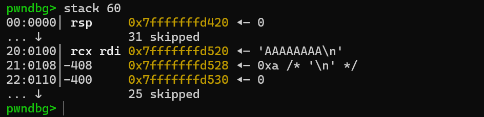
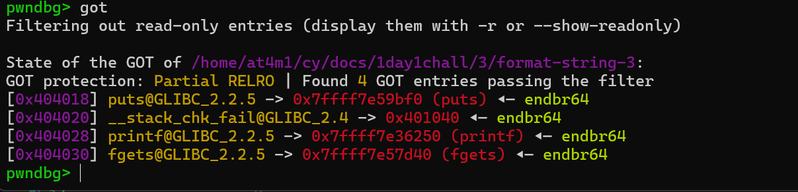
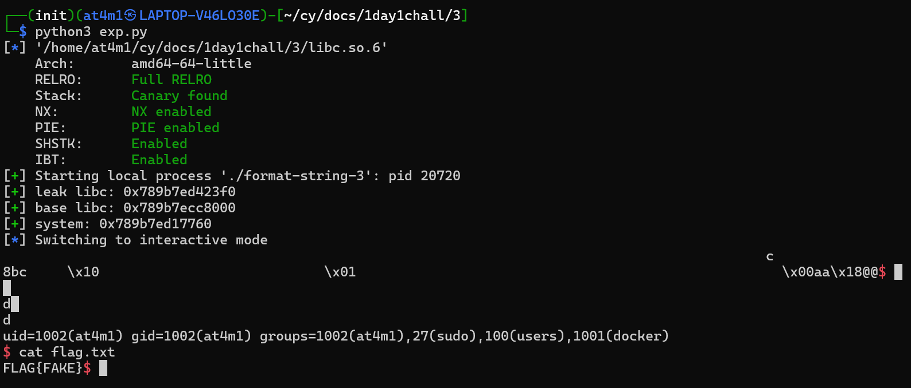
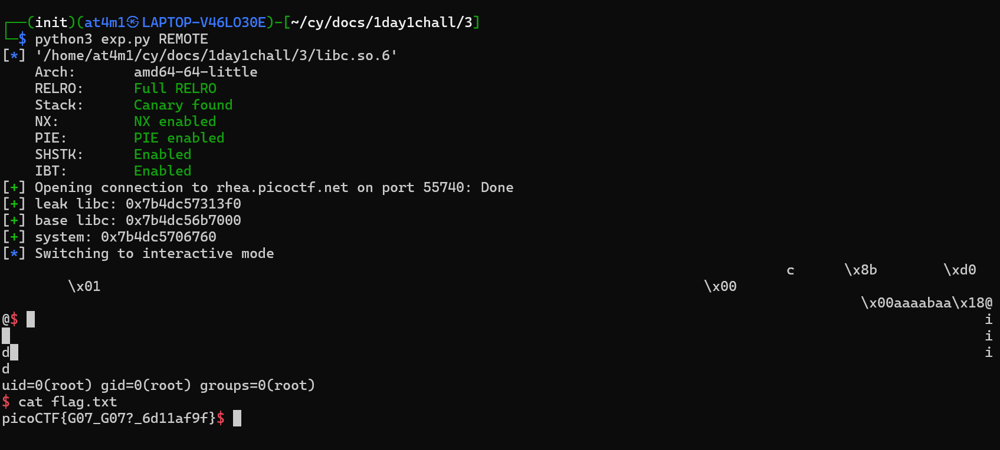

# Writeups

Hari ini gw bakal belajar *got overwrite* via format string. gw bakal ngerjain sebuah chall dari picoCTF yang nama Challenges nya `Format String 3`.

Kalo dijalanin kelihatan kalo disitu diberi leak libc nya. 

Gw coba pake checksec buat lihat ada protection apa aja, dan ternyata disitu tidak ada PIE yag berarti address binary nya tidak di random dan partial relro yang artinya gw bisa overwrite got nya

kalo di cek assembly nya pake gdb, kelihatan kalo kerentanan format string ada di function main+160 kalo gw break lalu run dan cek di stack nya 

input gw masuk di baris ke 38 yang berarti offsetnya adalah 38
kalo cek di assembly function main+175 itu ada puts yang bisa kita overwrite supaya bisa gw arahin ke yang gw mau dalam konteks ini adalah system

jadi selanjutnya gw dapetin address got nya si puts supaya gw arahin dia ke system dan ngejalanin /bin/sh sesuai isinya

sisanya gw pake `fmtstr_payload` untuk memudahkan untuk got overwritenya, disini gw bakal pake fake flag buat percobaan

dan ya gw berhasil buat dapetin shell sama fake flagnya

Selanjutnya gw coba terapin ke REMOTE

Gw pun berhasil dapet flag asli dari Challenges ini

## Lesson Learned
- coba cek stack dengan angka yang cukup besar supaya kelihatan semua
- kalo bukan full relro itu bisa di overwrite