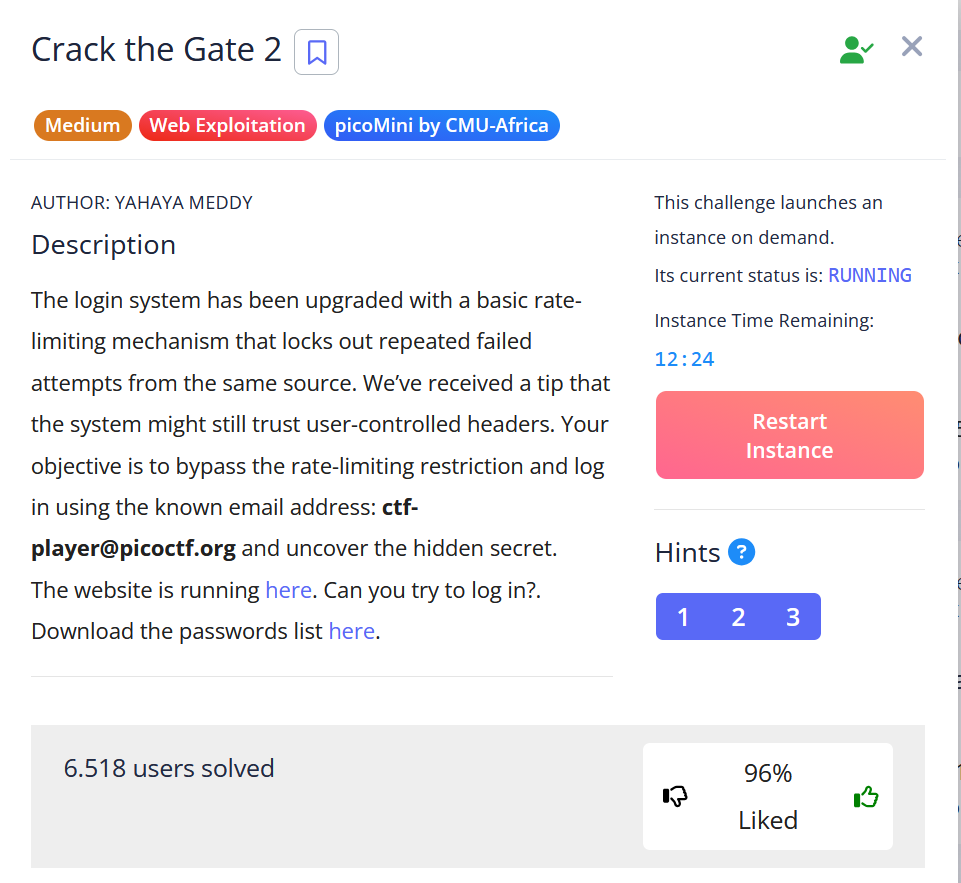
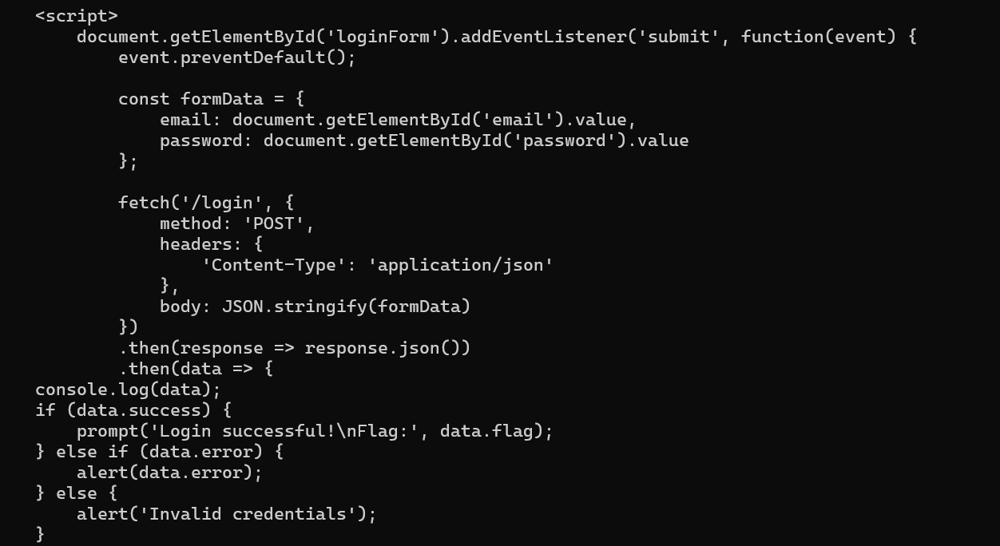
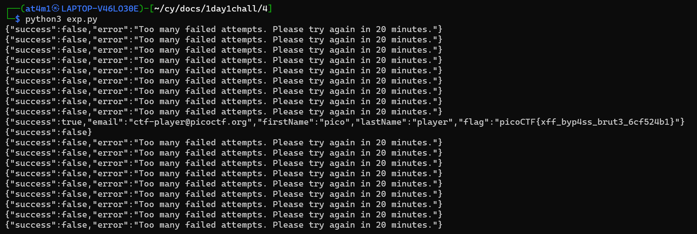

# Writeups

Hari ini gw mau belajar tools `request` di python buat keperluan Web Exploitation, gw bakal ngerjain Challenges dari picoCTF yang nama Challengesnya `Crack the Gate 2` sekaligus belajar penggunaan tools `request`

Jadi gw dikasih sebuah list password yang salah satunya password yang bener, disitu gw juga dikasih crendential emailnya

Gw coba buat read web nya pake `request.get()` dan gw dapet bagaimana fitur login bekerja, intinya kalo gw berhasil login dengan crendential yang bener bakal dapet flagnya

selanjutnya gw bikin scriptnya dengan looping buat mencoba setiap password yang ada di list password, gw terapin pake `request.post()`

dan ya gw berhasil login dan dapet flag dari Challenges ini

## Lesson Learned
- gunain request kalo mau automate alias kalo burp suite yang community harus manual
- request punya banyak fungsi selain itu kayak custom header, proxy, bahkan cookies juga