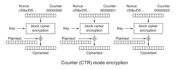
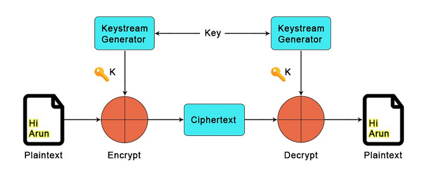
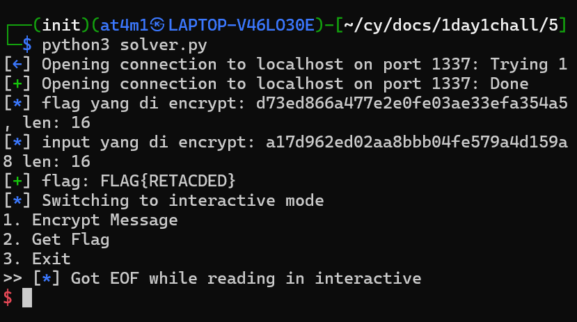

# Writeups

Hari ini gw mau belajar `XOR` sama `keystream` lewat chall `AES-CTR`

ini ada Cara kerja dari AES-CTR, dimana jenis ini menggunakan `nonce/counter` dan merubah `plaintext` menjadi `stream cipher`, masalahnya disitu key dan nonce nya yang sama dipakai lagi, yang membuat ini menjadi rentan

Kalo dilihat source codenya kelihatan kalo gw bisa nge encryption pesan apa aja yang gw mau kalo pilih opsi 1

Kalo pilih opsi 2 gw bakal dapet encryption flagnya

jadi cara kerjanya kayak begini:
`Ciphertext1 = Input ^ AES(Key, Nonce(IV))`
`ciphertext2 = flag ^ AES(key, nonce)`

masalahnya karena gw bisa bikin pesan dan nge encryption plus dapet encryption flagnya gw bisa dapetin `keystream`nya

jadi dengan cara kerja kayak tadi bisa di dapet kayak begini
`Flag ^ Ciphertext2 = Input ^ Ciphertext1`
dan buat dapet flag nya cukup pindahin aja dan sisain FLAG nya sendiri
`Flag = Input ^ Ciphertext1 ^ Ciphertext2` 

Selanjutnya gw jadikan script, disini gw jalankan `encrypt.py` nya pake socat supaya bisa di `nc` alias di remote, tinggal dengan pwntools dapetin dulu value - value nya abis itu wajib di `unhex()` alias dijadikan bytes dulu, kalo gak dijadiin bytes gak bakal bisa di XOR, pad input yang di xor buat supaya sama dengan source codenya

Sisanya tinggal jalankan

dan ya gw berhasil buat dapet flag nya

## Lesson Learned
- kalo jenisnya stream cipher dan punya kondisi yang sama coba dapetin keystreamnya
- kalo mau xor ubah ke bytes
- kalo ada nonce/counter itu AES-CTR