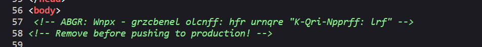
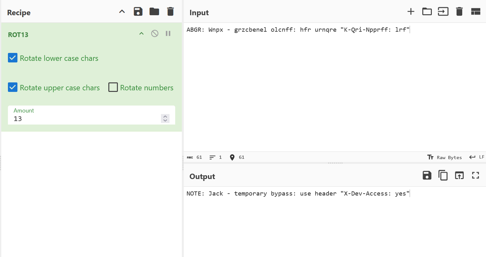
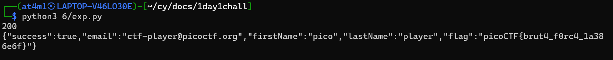

# Writeups

### 🌐 Web Exploitation

## Custom Headers with Python requests library

Hari ini gw mau ngerjain Challenges dari picoCTF atau sekarang namanya `Cylabacademy` yang nama `Crack the Gate 1`

kalo dijalanin sama diakses webnya, kelihatan kalo gw ada di login page, dan hal pertama yang gw lakuin yaitu ngecek view source nya

nah disitu ada text yang mencurigakan tapi kelihatan kayak cuma digeser doang per hurufnya

Gw pake rot13 buat ngebalikinnya

Disitu kelihatan kalo gw bisa bypass pake secret header mereka dan gw terapin pake library requestsnya python, sesuain username yang dikasih, dan pake random password
dan hasilnya gw berhasil buat dapet flagnya

## Lesson Learned
- Selalu check view source jika web